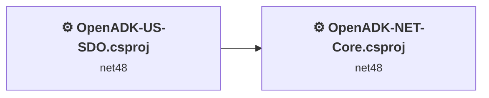
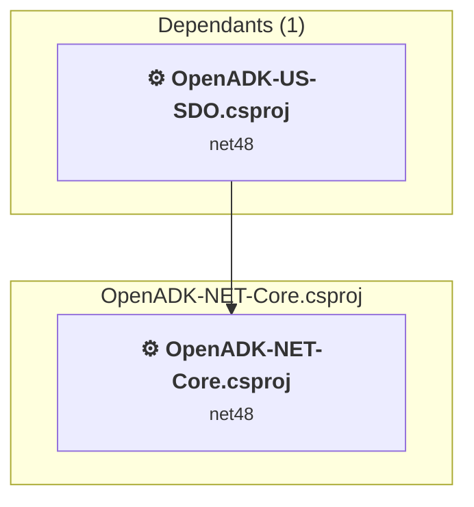
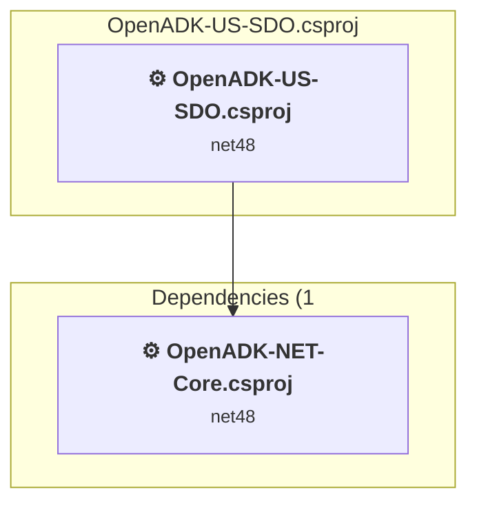

# Projects and dependencies analysis

This document provides a comprehensive overview of the projects and their dependencies in the context of upgrading to .NETCoreApp,Version=v10.0.

## Table of Contents

- [Executive Summary](#executive-Summary)
  - [Highlevel Metrics](#highlevel-metrics)
  - [Projects Compatibility](#projects-compatibility)
  - [Package Compatibility](#package-compatibility)
  - [API Compatibility](#api-compatibility)
- [Aggregate NuGet packages details](#aggregate-nuget-packages-details)
- [Top API Migration Challenges](#top-api-migration-challenges)
  - [Technologies and Features](#technologies-and-features)
  - [Most Frequent API Issues](#most-frequent-api-issues)
- [Projects Relationship Graph](#projects-relationship-graph)
- [Project Details](#project-details)

  - [core\OpenADK-NET-Core.csproj](#coreopenadk-net-corecsproj)
  - [us\OpenADK-US-SDO.csproj](#usopenadk-us-sdocsproj)

## Executive Summary

### Highlevel Metrics

| Metric | Count | Status |
| :--- | :---: | :--- |
| Total Projects | 2 | All require upgrade |
| Total NuGet Packages | 0 | All compatible |
| Total Code Files | 1467 |  |
| Total Code Files with Incidents | 948 |  |
| Total Lines of Code | 243338 |  |
| Total Number of Issues | 1953 |  |
| Estimated LOC to modify | 1947+ | at least 0.8% of codebase |

### Projects Compatibility

| Project | Target Framework | Difficulty | Package Issues | API Issues | Est. LOC Impact | Description |
| :--- | :---: | :---: | :---: | :---: | :---: | :--- |
| [core\OpenADK-NET-Core.csproj](#coreopenadk-net-corecsproj) | net48 | 🟢 Low | 1 | 379 | 379+ | ClassicWinForms, Sdk Style = False |
| [us\OpenADK-US-SDO.csproj](#usopenadk-us-sdocsproj) | net48 | 🟢 Low | 1 | 1568 | 1568+ | ClassicClassLibrary, Sdk Style = False |

### Package Compatibility

| Status | Count | Percentage |
| :--- | :---: | :---: |
| ✅ Compatible | 0 | 0.0% |
| ⚠️ Incompatible | 0 | 0.0% |
| 🔄 Upgrade Recommended | 0 | 0.0% |
| ***Total NuGet Packages*** | ***0*** | ***100%*** |

### API Compatibility

| Category | Count | Impact |
| :--- | :---: | :--- |
| 🔴 Binary Incompatible | 8 | High - Require code changes |
| 🟡 Source Incompatible | 1892 | Medium - Needs re-compilation and potential conflicting API error fixing |
| 🔵 Behavioral change | 47 | Low - Behavioral changes that may require testing at runtime |
| ✅ Compatible | 305228 |  |
| ***Total APIs Analyzed*** | ***307175*** |  |

## Aggregate NuGet packages details

| Package | Current Version | Suggested Version | Projects | Description |
| :--- | :---: | :---: | :--- | :--- |

## Top API Migration Challenges

### Technologies and Features

| Technology | Issues | Percentage | Migration Path |
| :--- | :---: | :---: | :--- |
| Code Access Security (CAS) | 1848 | 94.9% | Code Access Security (CAS) APIs that were removed in .NET Core/.NET for security and performance reasons. CAS provided fine-grained security policies but proved complex and ineffective. Remove CAS usage; not supported in modern .NET. |
| Deprecated Remoting & Serialization | 7 | 0.4% | Legacy .NET Remoting, BinaryFormatter, and related serialization APIs that are deprecated and removed for security reasons. Remoting provided distributed object communication but had significant security vulnerabilities. Migrate to gRPC, HTTP APIs, or modern serialization (System.Text.Json, protobuf). |
| Legacy Cryptography | 5 | 0.3% | Obsolete or insecure cryptographic algorithms that have been deprecated for security reasons. These algorithms are no longer considered secure by modern standards. Migrate to modern cryptographic APIs using secure algorithms. |
| Legacy Configuration System | 4 | 0.2% | Legacy XML-based configuration system (app.config/web.config) that has been replaced by a more flexible configuration model in .NET Core. The old system was rigid and XML-based. Migrate to Microsoft.Extensions.Configuration with JSON/environment variables; use System.Configuration.ConfigurationManager NuGet package as interim bridge if needed. |

### Most Frequent API Issues

| API | Count | Percentage | Category |
| :--- | :---: | :---: | :--- |
| T:System.Security.Permissions.SecurityPermissionAttribute | 1848 | 94.9% | Source Incompatible |
| T:System.Uri | 37 | 1.9% | Behavioral Change |
| T:System.Runtime.Serialization.Formatters.Binary.BinaryFormatter | 7 | 0.4% | Source Incompatible |
| P:System.Uri.AbsoluteUri | 5 | 0.3% | Behavioral Change |
| M:System.ApplicationException.#ctor(System.Runtime.Serialization.SerializationInfo,System.Runtime.Serialization.StreamingContext) | 4 | 0.2% | Source Incompatible |
| T:System.Net.ICertificatePolicy | 4 | 0.2% | Binary Incompatible |
| M:System.TimeSpan.FromMilliseconds(System.Double) | 4 | 0.2% | Source Incompatible |
| M:System.Exception.#ctor(System.Runtime.Serialization.SerializationInfo,System.Runtime.Serialization.StreamingContext) | 4 | 0.2% | Source Incompatible |
| P:System.IO.DirectoryInfo.FullName | 3 | 0.2% | Binary Incompatible |
| M:System.Uri.#ctor(System.String) | 3 | 0.2% | Behavioral Change |
| T:System.Runtime.Serialization.Formatters.FormatterAssemblyStyle | 3 | 0.2% | Source Incompatible |
| M:System.Collections.Specialized.NameValueCollection.#ctor(System.Runtime.Serialization.SerializationInfo,System.Runtime.Serialization.StreamingContext) | 2 | 0.1% | Source Incompatible |
| T:System.Configuration.ConfigurationManager | 2 | 0.1% | Source Incompatible |
| P:System.Configuration.ConfigurationManager.AppSettings | 2 | 0.1% | Source Incompatible |
| P:System.Uri.AbsolutePath | 2 | 0.1% | Behavioral Change |
| M:System.TimeSpan.FromSeconds(System.Double) | 2 | 0.1% | Source Incompatible |
| M:System.SystemException.#ctor(System.Runtime.Serialization.SerializationInfo,System.Runtime.Serialization.StreamingContext) | 2 | 0.1% | Source Incompatible |
| T:System.TimeZone | 2 | 0.1% | Source Incompatible |
| M:System.Exception.GetObjectData(System.Runtime.Serialization.SerializationInfo,System.Runtime.Serialization.StreamingContext) | 1 | 0.1% | Source Incompatible |
| P:System.Type.IsSerializable | 1 | 0.1% | Source Incompatible |
| M:System.TimeSpan.FromDays(System.Double) | 1 | 0.1% | Source Incompatible |
| T:System.Net.ServicePointManager | 1 | 0.1% | Source Incompatible |
| P:System.Net.ServicePointManager.CertificatePolicy | 1 | 0.1% | Binary Incompatible |
| M:System.Net.WebRequest.Create(System.Uri) | 1 | 0.1% | Source Incompatible |
| T:System.Security.Cryptography.RC2CryptoServiceProvider | 1 | 0.1% | Source Incompatible |
| T:System.Security.Cryptography.TripleDESCryptoServiceProvider | 1 | 0.1% | Source Incompatible |
| T:System.Security.Cryptography.DESCryptoServiceProvider | 1 | 0.1% | Source Incompatible |
| T:System.Security.Cryptography.MD5CryptoServiceProvider | 1 | 0.1% | Source Incompatible |
| T:System.Security.Cryptography.SHA1Managed | 1 | 0.1% | Source Incompatible |

## Projects Relationship Graph

Legend:
📦 SDK-style project
⚙️ Classic project

## Project Details

### core\OpenADK-NET-Core.csproj

#### Project Info

- **Current Target Framework:** net48
- **Proposed Target Framework:** net10.0-windows
- **SDK-style**: False
- **Project Kind:** ClassicWinForms
- **Dependencies**: 0
- **Dependants**: 1
- **Number of Files**: 437
- **Number of Files with Incidents**: 162
- **Lines of Code**: 75519
- **Estimated LOC to modify**: 379+ (at least 0.5% of the project)

#### Dependency Graph

Legend:
📦 SDK-style project
⚙️ Classic project

### API Compatibility

| Category | Count | Impact |
| :--- | :---: | :--- |
| 🔴 Binary Incompatible | 8 | High - Require code changes |
| 🟡 Source Incompatible | 324 | Medium - Needs re-compilation and potential conflicting API error fixing |
| 🔵 Behavioral change | 47 | Low - Behavioral changes that may require testing at runtime |
| ✅ Compatible | 64134 |  |
| ***Total APIs Analyzed*** | ***64513*** |  |

#### Project Technologies and Features

| Technology | Issues | Percentage | Migration Path |
| :--- | :---: | :---: | :--- |
| Deprecated Remoting & Serialization | 7 | 1.8% | Legacy .NET Remoting, BinaryFormatter, and related serialization APIs that are deprecated and removed for security reasons. Remoting provided distributed object communication but had significant security vulnerabilities. Migrate to gRPC, HTTP APIs, or modern serialization (System.Text.Json, protobuf). |
| Legacy Configuration System | 4 | 1.1% | Legacy XML-based configuration system (app.config/web.config) that has been replaced by a more flexible configuration model in .NET Core. The old system was rigid and XML-based. Migrate to Microsoft.Extensions.Configuration with JSON/environment variables; use System.Configuration.ConfigurationManager NuGet package as interim bridge if needed. |
| Legacy Cryptography | 5 | 1.3% | Obsolete or insecure cryptographic algorithms that have been deprecated for security reasons. These algorithms are no longer considered secure by modern standards. Migrate to modern cryptographic APIs using secure algorithms. |
| Code Access Security (CAS) | 280 | 73.9% | Code Access Security (CAS) APIs that were removed in .NET Core/.NET for security and performance reasons. CAS provided fine-grained security policies but proved complex and ineffective. Remove CAS usage; not supported in modern .NET. |

### us\OpenADK-US-SDO.csproj

#### Project Info

- **Current Target Framework:** net48
- **Proposed Target Framework:** net10.0
- **SDK-style**: False
- **Project Kind:** ClassicClassLibrary
- **Dependencies**: 1
- **Dependants**: 0
- **Number of Files**: 1030
- **Number of Files with Incidents**: 786
- **Lines of Code**: 167819
- **Estimated LOC to modify**: 1568+ (at least 0.9% of the project)

#### Dependency Graph

Legend:
📦 SDK-style project
⚙️ Classic project

### API Compatibility

| Category | Count | Impact |
| :--- | :---: | :--- |
| 🔴 Binary Incompatible | 0 | High - Require code changes |
| 🟡 Source Incompatible | 1568 | Medium - Needs re-compilation and potential conflicting API error fixing |
| 🔵 Behavioral change | 0 | Low - Behavioral changes that may require testing at runtime |
| ✅ Compatible | 241094 |  |
| ***Total APIs Analyzed*** | ***242662*** |  |

#### Project Technologies and Features

| Technology | Issues | Percentage | Migration Path |
| :--- | :---: | :---: | :--- |
| Code Access Security (CAS) | 1568 | 100.0% | Code Access Security (CAS) APIs that were removed in .NET Core/.NET for security and performance reasons. CAS provided fine-grained security policies but proved complex and ineffective. Remove CAS usage; not supported in modern .NET. |

